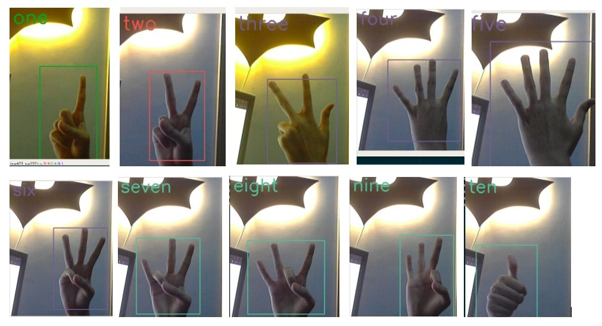

# Hand-Gestures-Recognition-ASL




## Project Features.

- Detects and recgnize real time American sign language 1-10 Signs .

## Prerequisites

- Python3
- OpenCV
- Numpy

## Yolo and Darknet-53

- For Real time object Detection [Yolo](https://pjreddie.com/darknet/yolo/) (You Only Look Once) is used.
- [Darknet-53](https://pjreddie.com/darknet/) is used to train model for face detection.
- Darknet is an open source neural network framework by [Joseph Redmon](https://github.com/pjreddie)

### This application is tested on Linux and macOS and windows*

- Clone this Repo

```bash
git clone https://github.com/TeamCeltz/Data_driven_accessible_system.git
```

- Install requirements

```bash
pip3 install -r requirements.txt
```

- Go with anaconda and Virtual Environment

```
Create new environment install requirements and run command pyhton3 script.py to test the system
```

### Download Yolo Weights and move it in Yolo Folder.

[Download!](https://drive.google.com/file/d/11uRz9slxOS54CmuaWtnzVOFVUNYufN2i/view?usp=sharing)


- Run

```bash
$ pyhton3 script.py
```

- make sure before running code paste .weights file in Directory\*

## Check out my other Deep Learning Projects

- [Face detection and recognition!](https://github.com/ShahrozTanveer/Face-Detection-and-Recognition)
- [Hand-Gestures-Recognition (1-5) using Darknet& YOLO](https://github.com/ShahrozTanveer/Hand-Gestures-Recognition)

Please consider following this project's author, [Sharoz Tanveer](https://github.com/ShahrozTanveer), and consider starring the project to show your :heart: and support.

### Author
#### This project is originally organized by **SHAROZ TANVEER** you can find him on different platforms

- [LinkedIn Profile](https://www.linkedin.com/in/sharoztanveer/)
- [GitHub Profile](https://github.com/ShahrozTanveer)
- [Twitter Profile](https://twitter.com/saadtanveer3121)

### License

Copyright © 2020, [Sharoz Tanveer](https://github.com/ShahrozTanveer).
Released under the [MIT License](LICENSE).
